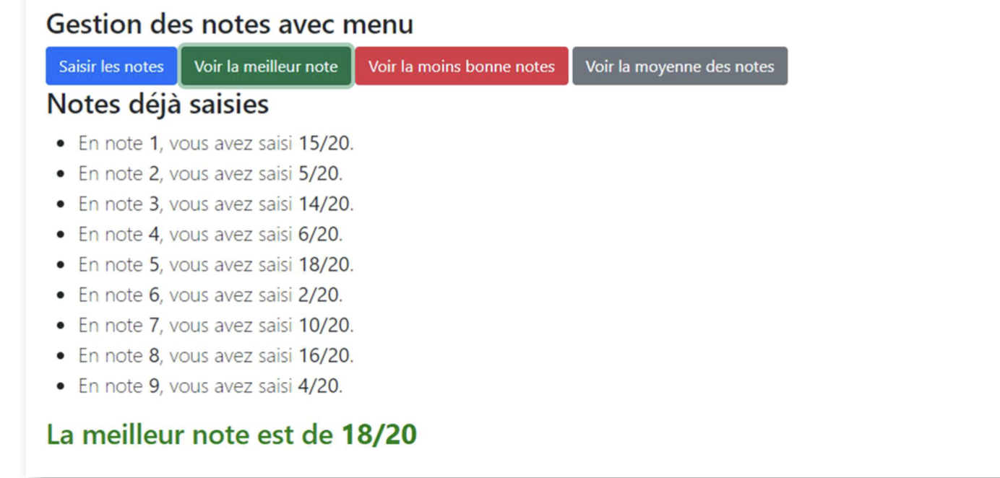

## Exercice 16 ***Manipulation du dom***

***Objectifs:***
    Utilisation du javascript pour intéragir avec le DOM HTML. 

- Réalisez un programme qui permet de proposer les mêmes fonctionnalités que l'exercice 14 avec un affichage dans le dom HTML qui ressemble à :
