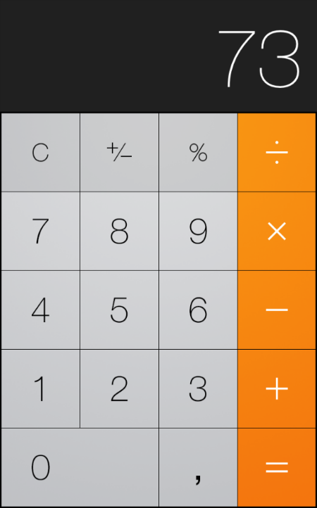

## Exercice 18 ***Manipulation du dom***

***Objectifs:***
    Utilisation du javascript pour intéragir avec le DOM HTML. 

- En utilisant du javascript et du HTML réaliser la calculatrice suivante:

